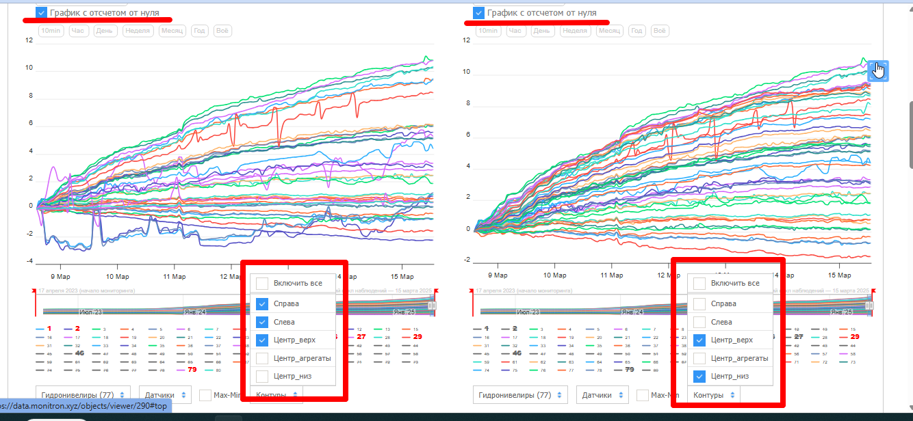
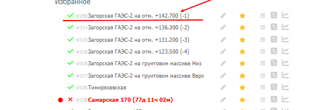
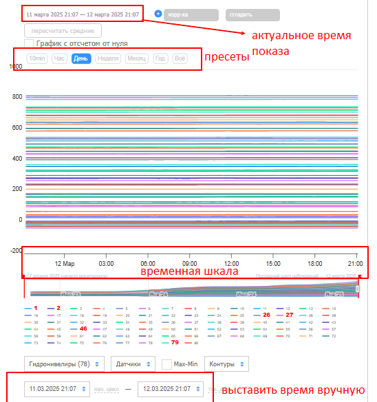
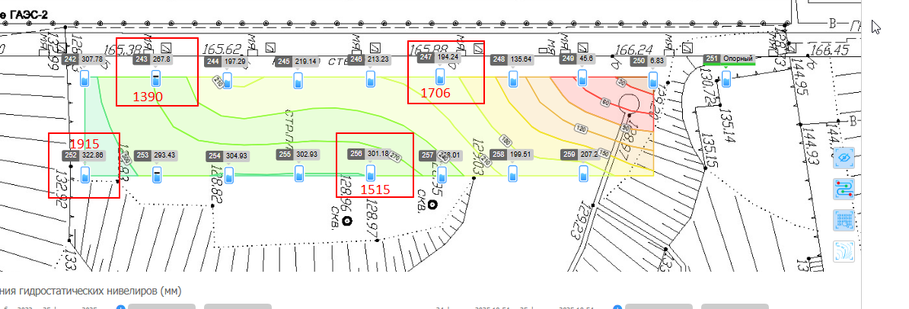
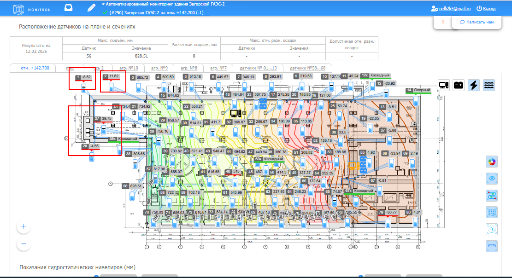

# Индикация объектов на главной странице

## Цвета объектов

| Индикация | Что означает | Что делать |
|---|---|---|
| Зелёная галочка | Объект работает в обычном режиме | Ничего |
| Оранжевый `!` | Объект работает со сбоями | Проверить, какие источники проблемные |
| Красный `✕` | Весь объект, вероятно, не в сети | Обязательно проверить |

При наведении на `!` или `✕` видно: сколько времени объект не в сети и какие именно источники требуют внимания.

## Как читать оранжевый объект

Оранжевый не значит, что всё упало. Часть источников может работать нормально.

Пример: объект на -1 этаже с двумя ПК и двумя источниками на каждом. Оранжевый `!` показывает только те источники, у которых есть сбой. Остальные — в норме.

## Информационные окна на главной

**Датчики, требующие внимания** — разница между min и max за последние 24 ч или 6 ч превышает порог (3 мм для суток, 2 мм для 6 ч).

**Датчики без показаний** — датчики со звёздочками `******`. Проверять наравне с новыми скачками.

- До 30 циклов без показаний — можно понаблюдать, данные могут появиться
- Больше 30 циклов — проверить удалённый ПК, при необходимости внести в проблемные

**Цвета датчиков на карте объекта:**

- Красный — оффлайн более 15 минут
- Оранжевый — без показаний более 30 циклов
- Жёлтый — без показаний более 3 циклов

