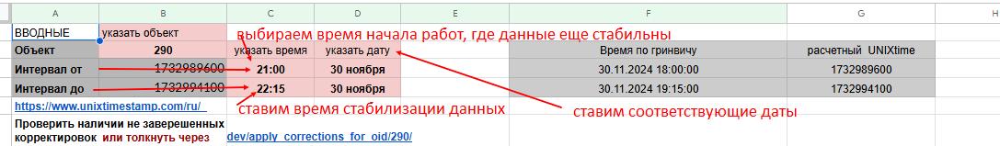
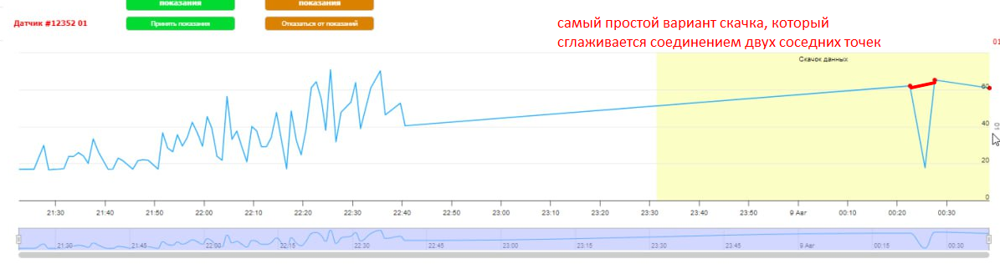
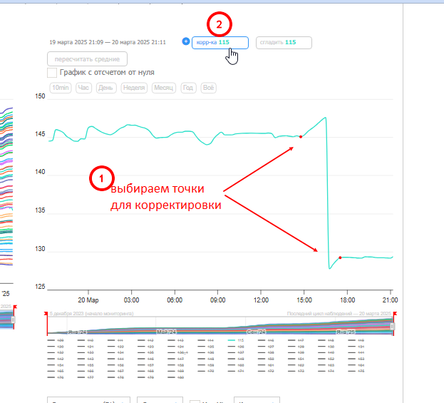
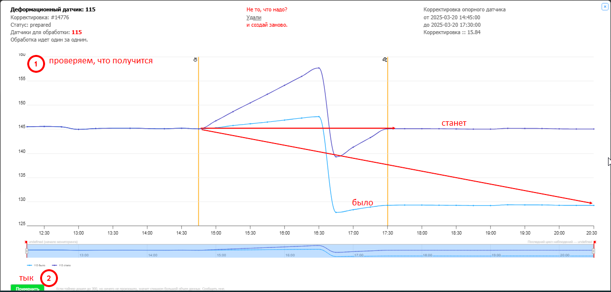
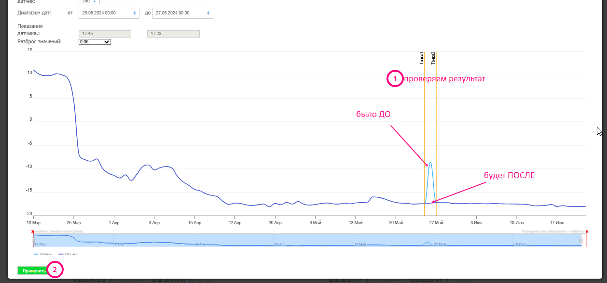
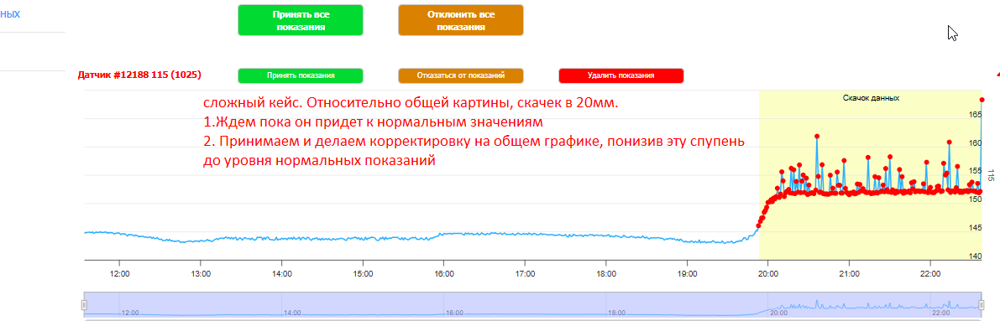

# Корректировки и сглаживания

Применяются для наведения порядка на графиках после технических работ, замен датчиков, обслуживания.

## Подготовка — выбор отметок

1. Определить две временных точки:
    - **Левая** — момент до начала работ, когда показания были в норме
    - **Правая** — момент стабилизации после работ
2. Занести значения датчиков в таблицу с данными
3. В последнем столбце (дельта) написать формулу сложения двух предыдущих ячеек

!!! tip
    Значения с графика записывать через запятую, чтобы Excel воспринимал как число.

## Ручные сглаживания

Применяются для отдельных датчиков. Открыть нужный объект → общий график → выбрать датчик → провести сглаживание в нужном диапазоне.

## Ручные корректировки

Применяются для точной правки значений. Выбрать диапазон → ввести дельту → применить.

## Массовые корректировки

Через таблицу SLA «Список проблемных датчиков» — вкладки для каждого этажа и улицы.

Выбрать нужный источник → нажать на ссылку → ввести параметры в открывшемся окне → закрыть → проверить запуск на главной странице Монитрона.

## Массовые сглаживания

Можно запускать для всех датчиков объекта или выборочных групп. Допускается несколько сглаживаний одновременно.

---

## Особенности -1 этажа Загорской ГС

На -1 этаже каскадная зависимость датчиков. Перед корректировками — обязательно сначала привести в порядок каскадные датчики.

**Схема каскадов:**

| Каскадный датчик | Зависимые датчики |
|---|---|
| 14 (опорный) | 12, 13, 67, 68, 69, 79, 80 |
| 12к | 3–11, 15–25, 28–38 |
| 38к | 1, 2, 26, 27 |
| 63к | 39–54 |
| 67к | 55–66, 70–78 |

**Порядок корректировок на -1:**

1. Сначала датчик 12 — ждать, пока волна уйдёт на зависимые
2. Затем датчик 38 — после него правим 1, 2, 26, 27 вручную
3. Затем датчики 63 и 67 — нижний контур

!!! warning
    Корректировку «всех источников сразу» для -1 этажа не применять — функция не актуальна. Только по контурам, по очереди.

На остальных объектах можно применять корректировку для всех датчиков одновременно.
