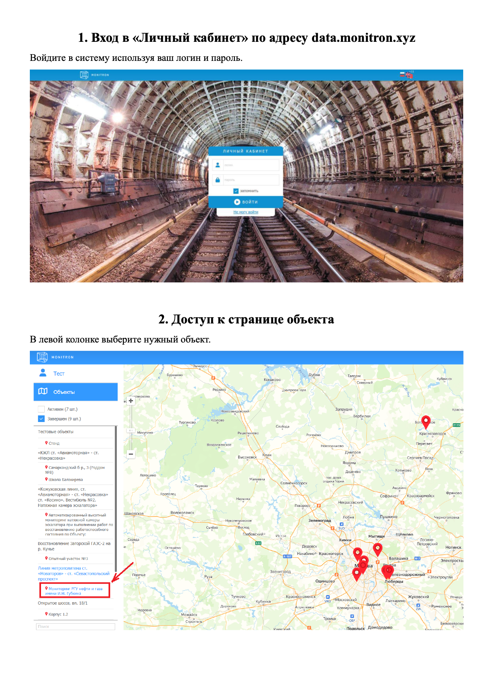
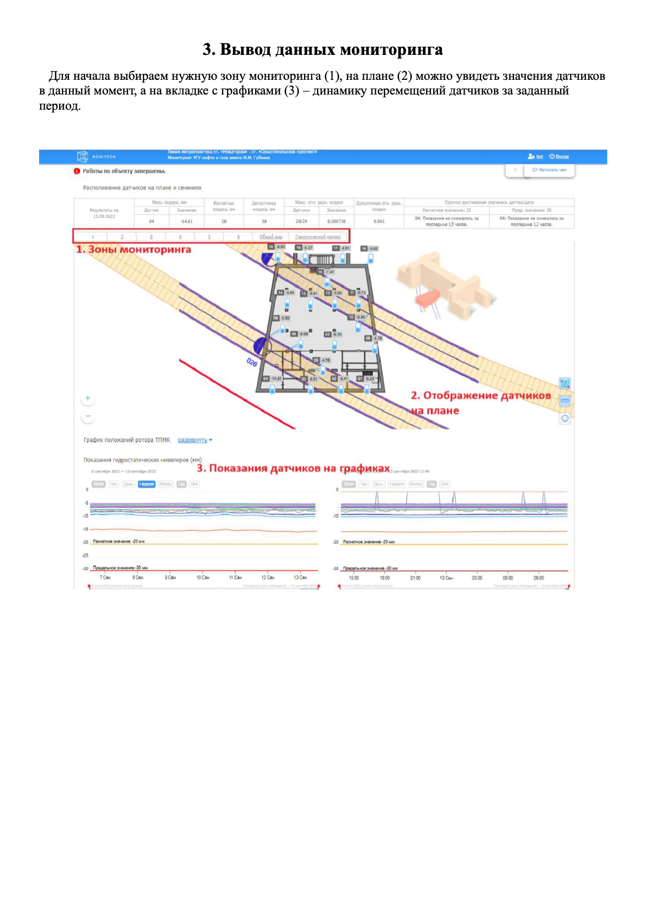
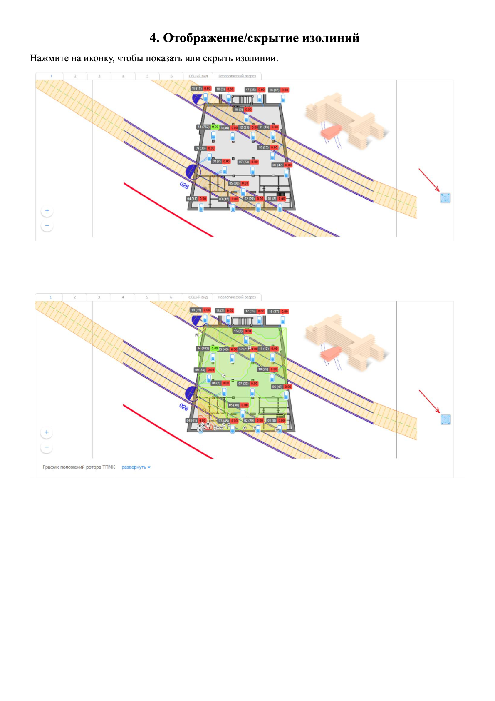
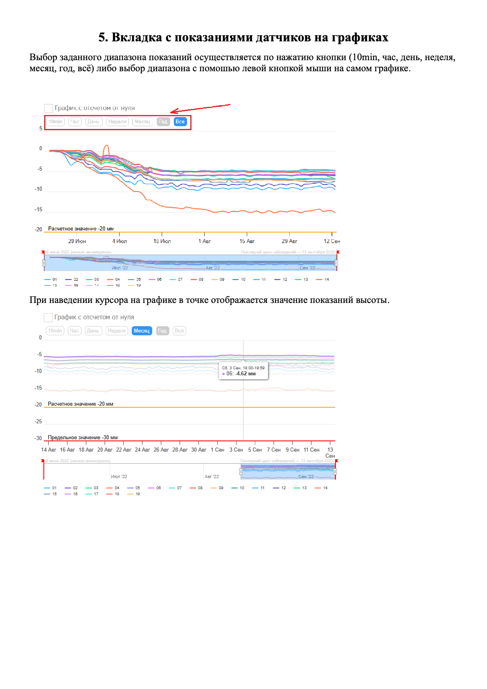
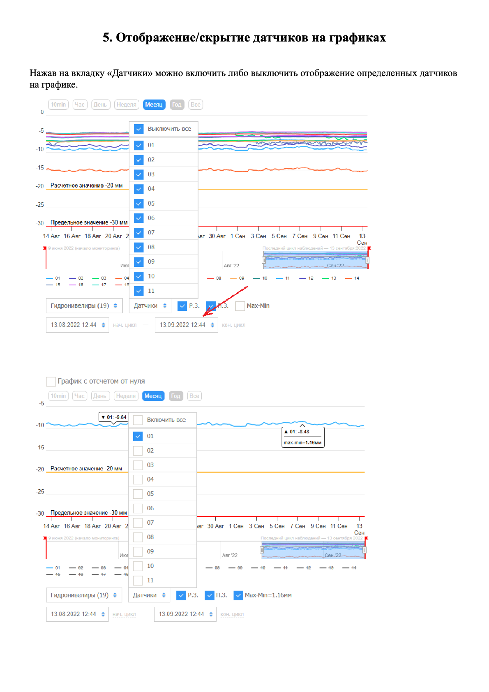
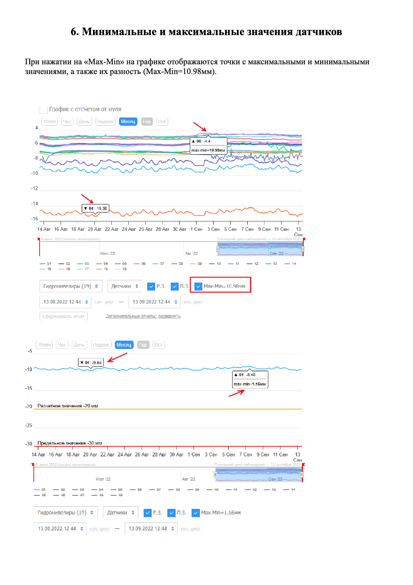
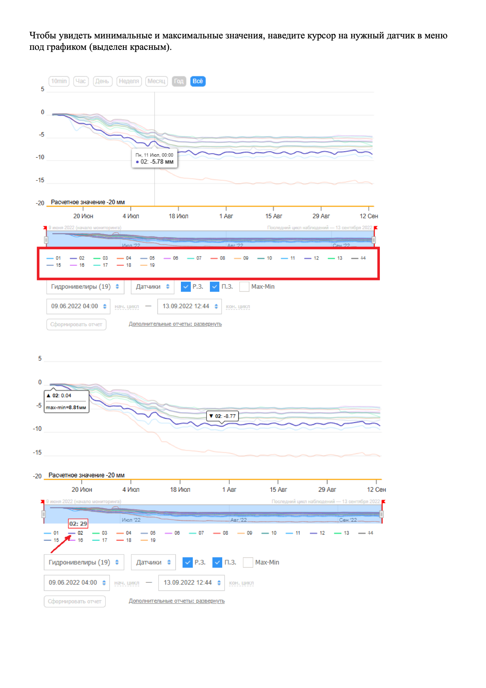
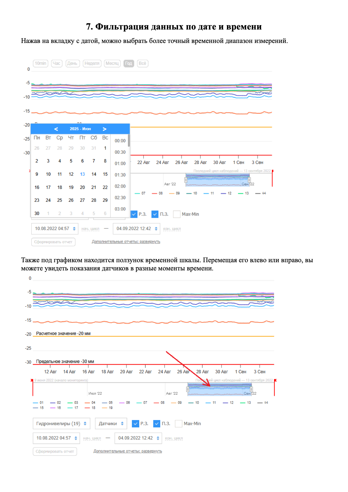

# Личный кабинет веб-интерфейса

Адрес: **data.monitron.xyz**

## 1. Вход в систему и выбор объекта

Введите логин и пароль на странице входа. Можно поставить галочку «Запомнить».

После входа в левой колонке отображается список объектов (активные и завершённые). Нажмите на нужный объект, чтобы перейти к его данным.

## 3. Страница объекта

На странице три основных области:

1. **Зоны мониторинга** — вкладки в верхней части, переключают контур наблюдения
2. **План объекта** — отображает датчики с текущими значениями
3. **Графики** — динамика перемещений за выбранный период

## 4. Изолинии

Нажмите на иконку в правой части плана, чтобы показать или скрыть изолинии. При включении зона выделяется зелёным.

## 5. Графики датчиков

### Выбор периода и чтение значений

Период выбирается кнопками: **10min · Час · День · Неделя · Месяц · Год · Всё**

Можно задать произвольный диапазон: выделить участок левой кнопкой мыши прямо на графике.

При наведении курсора на график — всплывает подсказка с точным значением высоты в этой точке.

### Включение и выключение датчиков

Нажмите вкладку **Датчики** под графиком — откроется список с чекбоксами. Можно выключить отдельные датчики или нажать «Выключить все», чтобы смотреть только один.

### Минимальные и максимальные значения

Включите чекбокс **Max-Min** в панели под графиком — на линиях появятся точки с максимальным и минимальным значением, а также их разность (например, `Max-Min=10.98 мм`).

Чтобы увидеть Min/Max конкретного датчика, наведите курсор на его название в легенде под графиком.

## 6. Фильтрация по дате и времени

Нажмите на поле с датой — откроется календарь с выбором даты и времени.

Под графиком находится **ползунок временной шкалы**: перемещайте его влево или вправо, чтобы быстро менять видимый период без открытия календаря.
