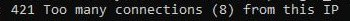
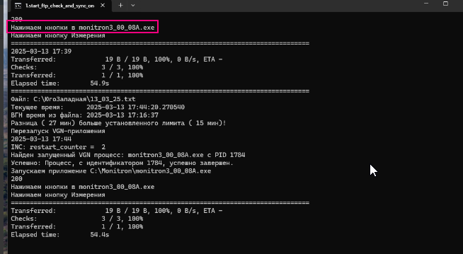

# Ошибки скрипта и ПО

## Скрипт в нормальном состоянии

В рабочем состоянии рулон работает так:

- Датчики голубые, с данными
- Выбранный COM-порт в статусе «Готов»
- Идёт отсчёт опроса

Если в скрипте всё чисто — проверить, запущены ли измерения в ПО.

---

## Ошибки скрипта

### 1. Ошибка установления соединения с сервером
Лечится сама. Может длиться долго. Ждать.

### 2. Too many connections
Частая ошибка. Лечится сама.

Если на ПК два источника и у обоих эта ошибка — включить один, дождаться исчезновения ошибки, затем включать второй.

!!! info "Почему возникает"
    На сервере разрешены только 8 подключений с одного IP. При перезапусках число желающих подключиться временно превышает лимит. Скрипты встают в очередь и подключаются по мере освобождения слотов.

### 3. Ошибка после «Too many connections»
Частая ошибка — хороший признак того, что скоро всё заработает. Данные ещё не подгрузились полностью, объект в это время может быть оранжевым.

### 4. Перезапуск ВГН-приложения
Когда скрипт постоянно перезапускает ПО, данные не успевают записаться в файл и не попадают на график.

**Решение:**
1. Перезапустить скрипт
2. Или дать ПО недолго поработать без скрипта, затем включить скрипт снова

Если при выключенном скрипте ПО начинает работать нормально — это не решение. Без скрипта данные не попадут на Монитрон. Проблема может быть в версии ПО — обновить до актуальной, сообщить в общий чат.

### 5. Ошибка Updater (ошибка обновления)
Отключить автообновление в конфиг-файле программы.

---

## Проблемы опроса

### Массовая задержка ответа от датчиков

Решения по очереди:

1. Перезагрузить удалённый ПК
2. Дёрнуть розетку ТАПО (на несколько секунд, если не помогло — выждать 5–10 минут)
3. Если предыдущие варианты не помогли — проблема на физическом уровне. Написать в СЛА, затем в чат ГСС

!!! warning
    Простая перезагрузка ПО при массовой задержке не помогает.

Такая ошибка быстро отслеживается в таблице со звёздочками — можно поймать на самом начале без потери данных.

### Часть датчиков красные, часть работает

Пробовать те же варианты, что при массовой задержке. Но скорее всего проблема на физическом уровне — требует выезда.

### Массовая прокрутка опроса

Решение аналогично массовой задержке.

---

## Ошибки RS-преобразователя / порта

### Порт занят — ПО не запускается

1. Проверить, не запущено ли уже рабочее ПО (случайный двойной запуск из-за подвисания)
2. Нажать «Отмена» — ПО закроется, перезапустить
3. Если не помогло — перезагрузить ПК

При начальной настройке ПК или физических работах на объекте ошибка порта может означать физическую проблему. Для проверки: Диспетчер устройств → проверить занятые COM-порты → сравнить с ПО.

### Неведомая ошибка, не влияющая на опрос

Вызывает панику, но на опрос не влияет.

**Решение:** нажать «Выход». Если ПО закроется — запустить обратно.
