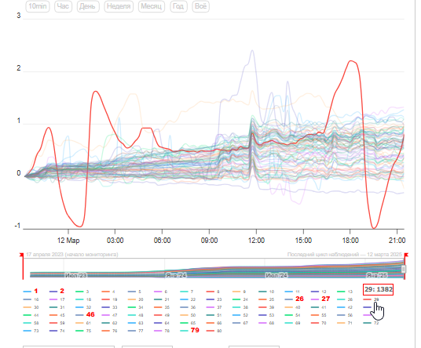
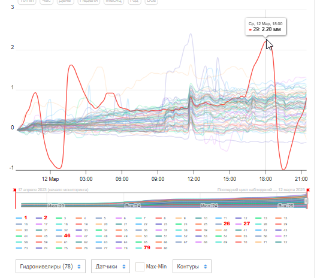
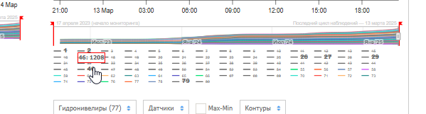
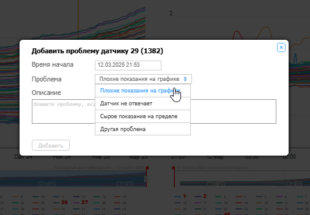
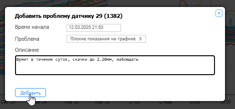
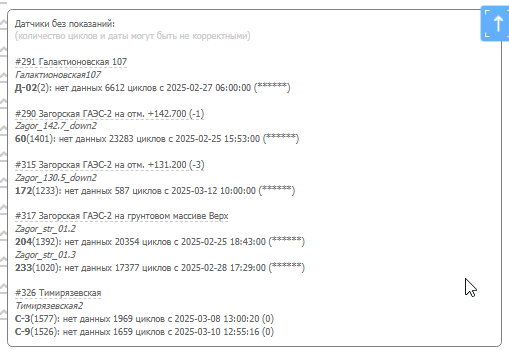

# Проблемные датчики

## Где искать проблемные датчики

**Главная страница Монитрона:**

- Окно «Датчики, требующие внимания» (за 24 ч и за 6 ч)
- Окно «Датчики без показаний» (звёздочки)
- Таблица проблемных датчиков

**Общий график объекта:**

- Смотреть «День», «Неделю», иногда «Месяц»
- Включить режим «График от нуля» — нагляднее
- Обращать внимание на «усы» — выбросы на фоне основной массы

Частота появления датчика в логе скачков — главный признак проблемности. Обращать внимание и на короткие, и на длительные скачки.

## Как занести датчик в проблемные

1. Открыть таблицу проблемных датчиков на главной
2. Выбрать проблему из списка
3. Написать описание — что происходит, с какой даты
4. Нажать «Добавить»

## Как обновлять статус проблемного датчика

Регулярно проверять датчики в таблице. Если появились новые отрицательные данные:

1. Нажать карандаш напротив датчика
2. Дописать описание с актуальной датой
3. Старые данные не удалять — продолжать описание
4. Сохранить

## Как снять датчик с проблемных

Если датчик стабилизировался и причина была единичной:

1. Выбрать значок «палец вверх»
2. Описать что помогло
3. Сохранить

## Скрытие датчика с графика

Скрытый датчик продолжает передавать данные, но не виден на графике.

**Скрыть с графика:**
Карандаш в объекте → Настройка датчиков → найти датчик (Ctrl+F) → отключить отображение

**Скрыть с карты (плана):**
Слои и датчики → найти датчик → отключить

!!! warning
    Если нужно исключить датчик из суточных отчётов заказчику — скрывать обязательно с карты. Только скрытие с графика от отчётов не спасает.

Включение обратно — по той же схеме.
