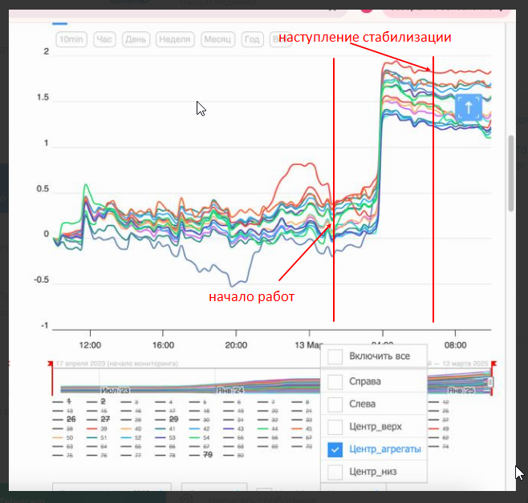
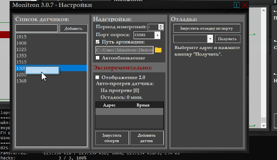

# Прогрев датчиков

## Версия 3.0.9 и выше

**Включение/отключение цикла обогрева.** После включения обогрев запускается автоматически в указанное время для каждого датчика. Состояние сохраняется после перезагрузки ПО.

**Повтор цикла:**
- «1 раз» — программа автоматически выключит обогрев в 00:00
- «Повторять каждый день» — расписание повторяется ежедневно

**Добавление датчиков в расписание:** выбрать номер датчика, указать время включения, выбрать длительность от 15 минут до 3 часов.

**Особенности:**
- Можно включать до 3 датчиков одновременно
- После перезапуска программы цикл прогрева восстанавливается с точки остановки

!!! example "Пример"
    В 12:00 по расписанию включаются датчики 1010 и 1011. Датчик 1010 должен выключиться в 13:00, датчик 1011 — в 14:00. Если программа закрылась в 12:40 и перезапустилась в 13:05 — она проверит расписание, выключит 1010 и продолжит греть 1011 до 14:00.

!!! warning
    Система работает в экспериментальном режиме. При ошибках — писать Максу Демидову.

## Версия 3.0.8

Прогрев включается через контекстное меню на нужном датчике в режиме колбочек. Там выбирается время прогрева.
