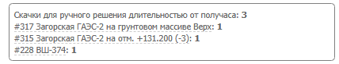
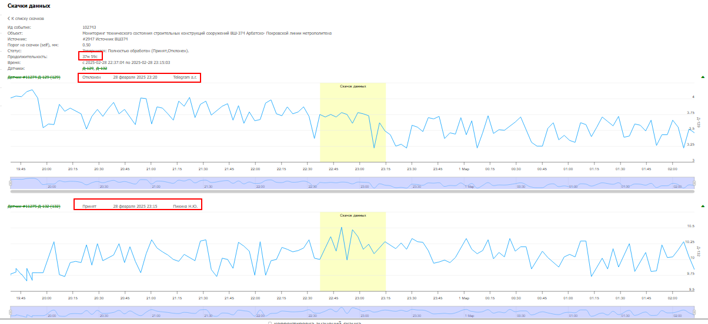
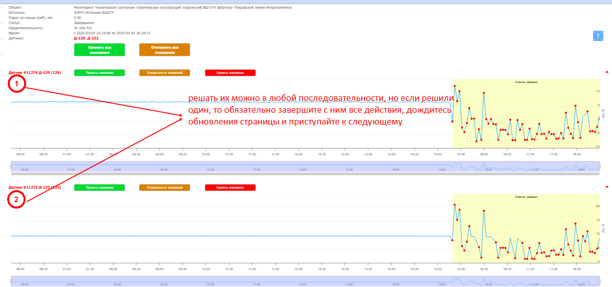
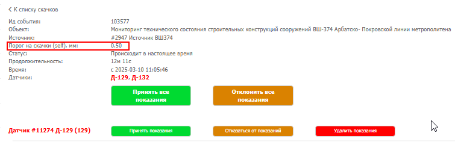
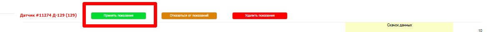
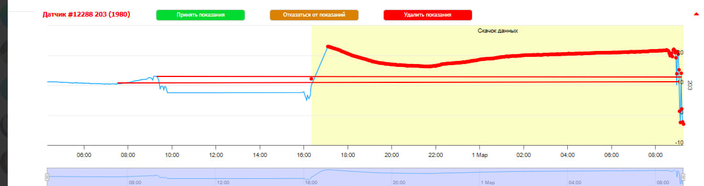
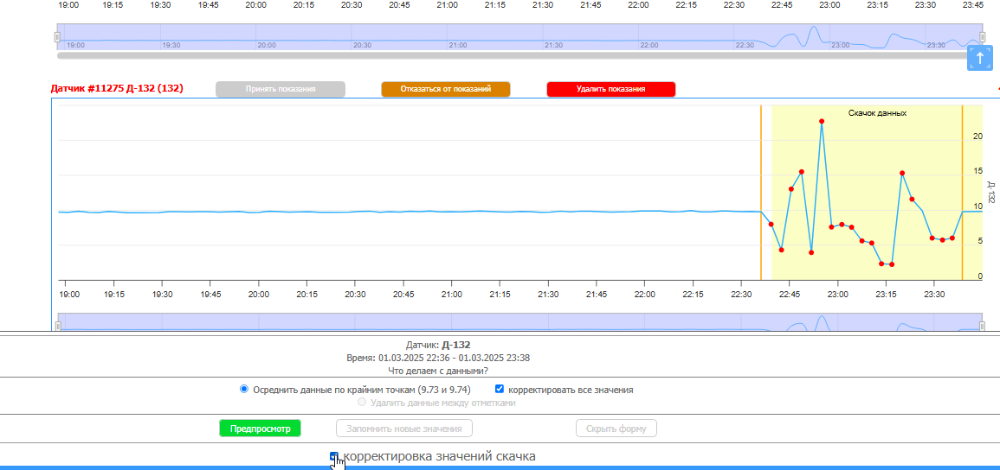
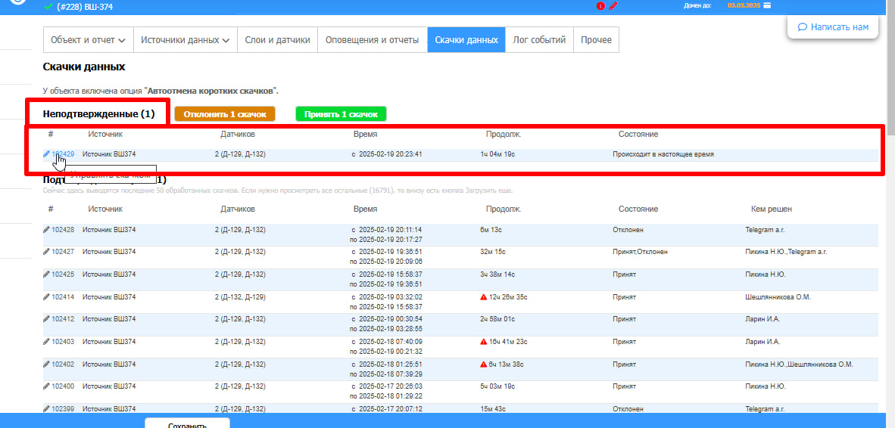
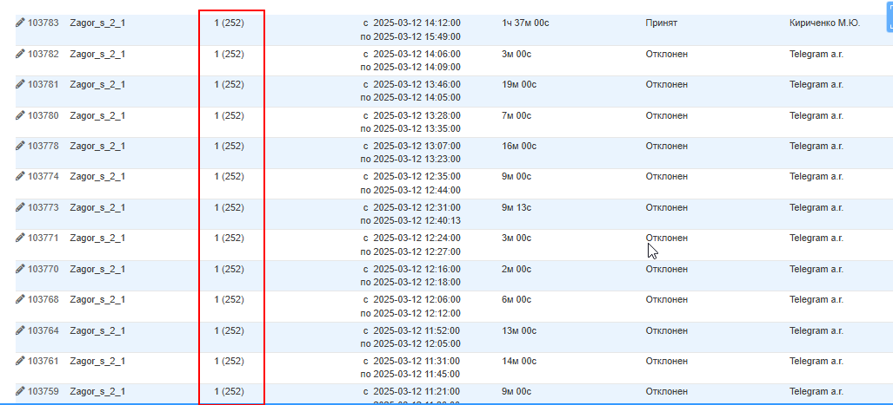

# Скачки данных

Скачок — изменение показаний датчика, превышающее индивидуальный порог. Требует ручного решения, если длится дольше 30 минут.

До 30 минут скачок обрабатывает Telegram-бот автоматически.

## Как закрыть скачок

1. На главной странице открыть окно «Скачки для ручного решения от получаса»
2. Если объектов несколько — смотреть по очереди
3. Внутри объекта открывать скачки снизу вверх
4. Скачки менее 30 минут не трогать — их закроет бот или они дозреют

## Что видно внутри скачка

- **Допустимый порог** — максимальная погрешность между первой и последней точкой. Индивидуален для каждого объекта. Устанавливается старшими сотрудниками.
- **Белая зона** — показания ДО скачка, уже на общем графике. Без острой необходимости не трогать.
- **Жёлтая зона** — зона самого скачка. Красные точки — данные, которые требуют решения.

## Кнопки решения

**Маленькие кнопки** (над каждым датчиком):

- **Принять показания** — принять как есть или с ручными правками

- **Отклонить показания** — уравнять с показаниями до скачка. Прерогатива бота, использовать редко
- **Удалить показания** — полностью удалить данные в зоне скачка. Только в исключительных случаях, с более опытными сотрудниками

**Большие кнопки** (на всю группу датчиков):

- **Принять ВСЕ** — когда все датчики ведут себя одинаково и не требуют индивидуальных правок
- **Отклонить ВСЕ** — аналогично

!!! warning "Осторожно"
    Кнопки «Отклонить» и «Удалить» использовать только при понимании что будет на выходе. При сомнениях — консультироваться с более опытными сотрудниками.

## Ручная корректировка значений

Если нужно сгладить пики перед принятием:

1. Включить чекбокс «Корректировка значений скачка»
2. Зажать правую кнопку мыши на начальной точке, потянуть до нужной
3. Выделенная область станет серой — появится панель со значениями
4. Нажать «Предпросмотр» — оценить результат
5. Если устраивает — «Запомнить новые значения», затем «Принять показания»

!!! tip
    Если предпросмотр не устраивает — перезагрузить страницу, скачок сбросится к исходному виду.

## Когда можно принять скачок без правок

- Показания в жёлтой зоне не превышают допустимый порог
- Жёлтая зона ведёт себя так же, как белая — без резких отклонений
- Скачок очевидный и однотипный по всем датчикам

## Лог скачков

Зайти в нужный объект → карандаш → вкладка «Скачки данных».

