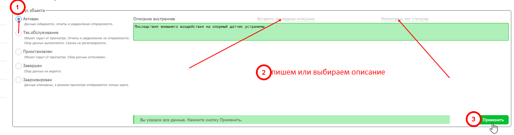
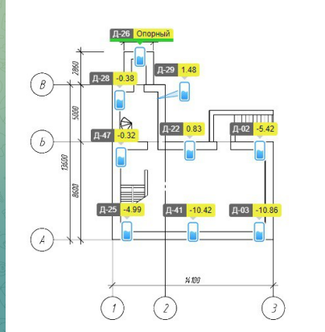

# Постановка и снятие с ТО

## Постановка на ТО

Следить за чатом — сообщения о ТО могут приходить как в общий чат, так и в чат ГСС. Обязательно отписаться, что объект на ТО поставлен.

**Как поставить:**

1. Зайти на нужный объект
2. Карандаш → Объект и отчёт → Основные настройки
3. Поставить объект на ТО, выбрать описание
4. Проверить на главной странице, что статус изменился

**Перед постановкой прочитать чат** — понять характер работ:
- Перевешивание датчиков (делают ГСС)
- Обслуживание проблемных датчиков (чаще делают специалисты Монитрона)

## Снятие с ТО

Обратное действие постановке. Выбрать описание, соответствующее проведённым работам.

!!! danger "Важно"
    Если ГСС или работники Монитрон пишут «Можно снимать с ТО» — не торопиться. Перед снятием привести объект в порядок и дождаться стабилизации показаний.

## После перевешивания датчиков

1. Проверить работу датчиков в ПО на удалённом ПК — идут ли данные
2. На главной Монитрона проверить, нет ли совсем мёртвых датчиков
3. Если данные не идут — сразу писать в чат ГСС, пока бригада ещё на объекте
4. Добиться, чтобы датчик заработал до отъезда бригады

## При обслуживании датчиков специалистами Монитрона

1. Оповестить коллег из ГСС о постановке на ТО
2. После работ — собрать все данные от специалистов
3. Свести в отчёт и отправить в чат ГСС

Формат отчёта: объект, номер головы, проведённые работы.

## Карта с расположением датчиков

Перед каждым выездом ГСС или Монитрона — сделать визуальную карту с нанесением датчиков.

**Важно:** указывать не только номер датчика, но и номер головы. Посмотреть номер головы можно:
- При наведении на номер датчика на карте объекта
- В настройках датчиков (карандаш → Источники → Гидронивелиры → Настройки датчиков)
- В таблице проблемных датчиков (в скобках после номера)
