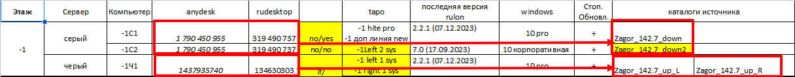
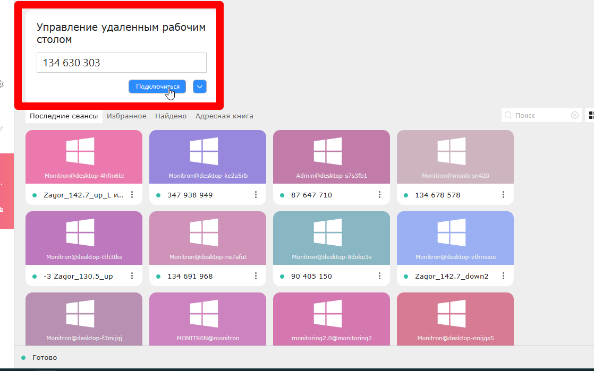
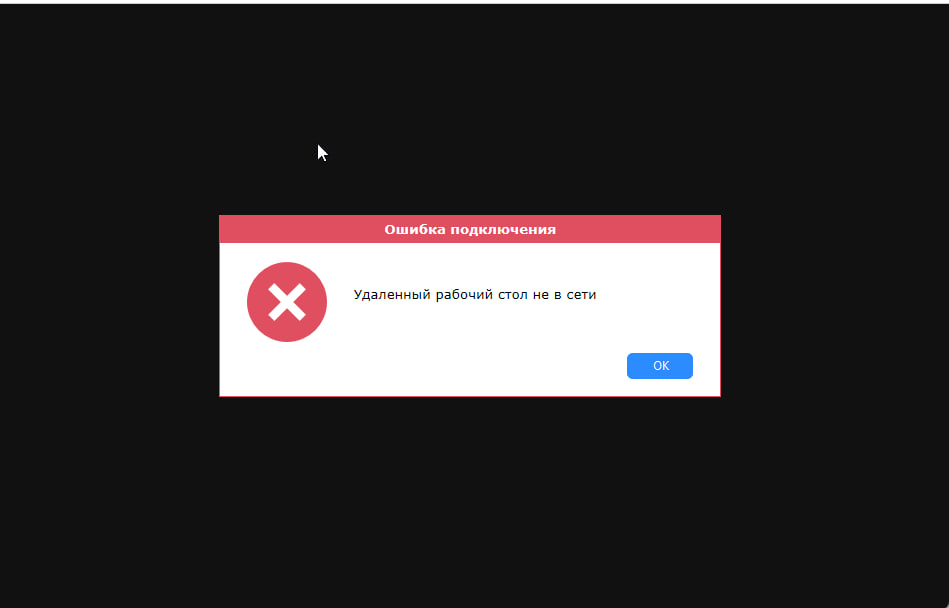
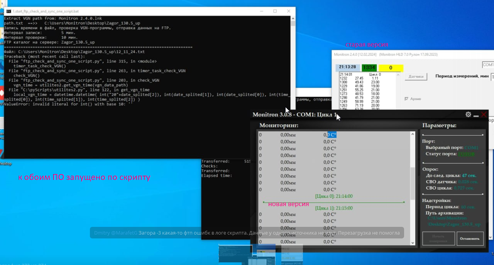
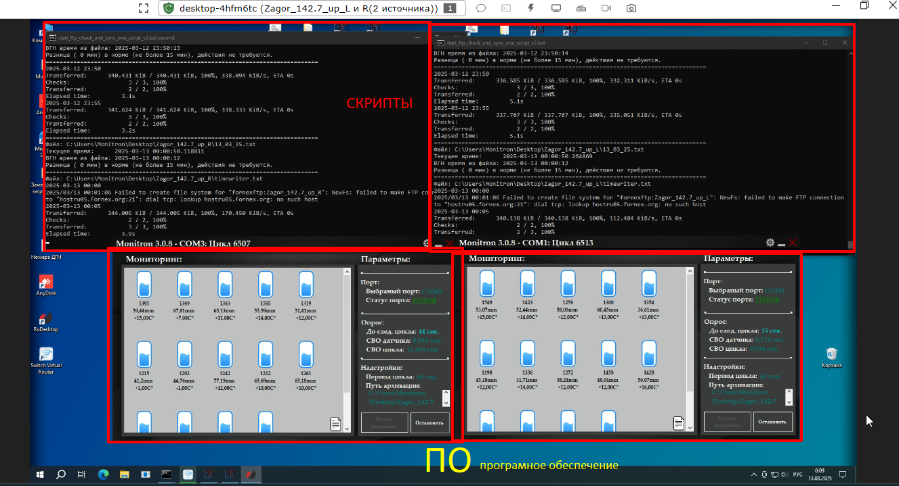
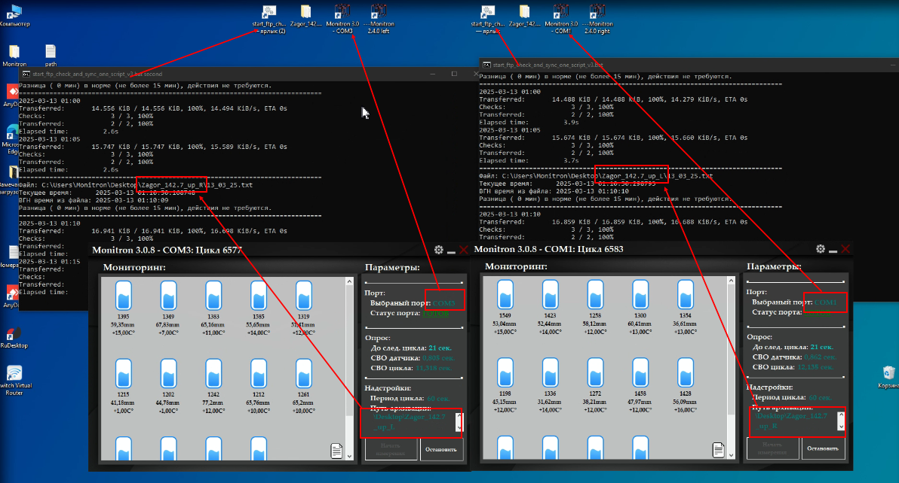

# Удалённые ПК

## Необходимый софт

- **RuDesktop** — https://rudesktop.ru/
- **AnyDesk** — https://anydesk.com/ru
- **База данных в Юджайл** — все доступы к объектам (доступ выдаётся)
- **Загора БД.xlsx** — отдельная таблица по Загорской ГАЭ

Вход на объект — логин и пароль из таблицы.

## Как понять, что есть проблема

Не ждать оповещения в Telegram — лучше чаще проверять главную страницу Монитрона.

Если проблема длится более 30 минут — в специальный чат Telegram придёт оповещение об отсутствии связи. После устранения придёт подтверждение.

## Нет доступа к удалёнке

Если объект показывает ошибку (красный или оранжевый), первым делом — проверить доступ к удалённому столу.

- **Нет доступа** → удалённый стол не в сети → нет связи с удалённым ПК → написать в соответствующий чат в стандартном формате
- **Доступ есть** → проверить работоспособность системы → перезагрузить ПК

## Перезагрузка ПК

**Через RuDesktop:** через меню перезагрузки в интерфейсе

**Через AnyDesk:** через молнию, или обычным способом через меню «Пуск» если молния недоступна

После перезагрузки скрипты и ПО иногда запускаются автоматически, но не всегда. Если не запустились — запустить вручную: сначала скрипты, затем ПО → «Запустить измерения» → подождать цикл → проверить что пошли данные.

## Что должно быть запущено

Для каждого источника — свой скрипт и своё ПО. Если на ПК два источника — два скрипта и два ПО.

Проверить соответствие запущенных программ источникам. Если что-то не сходится — перезагрузить ПК.
