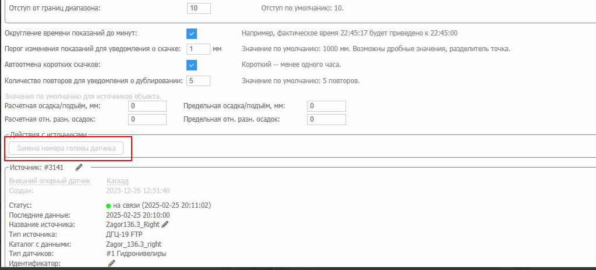
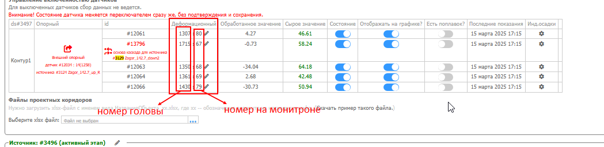
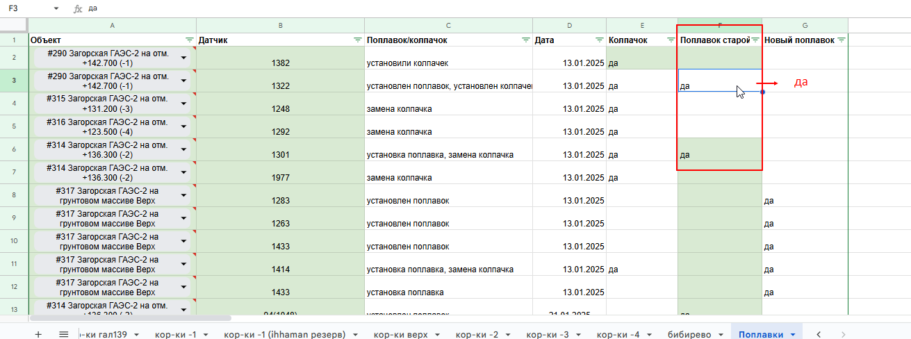
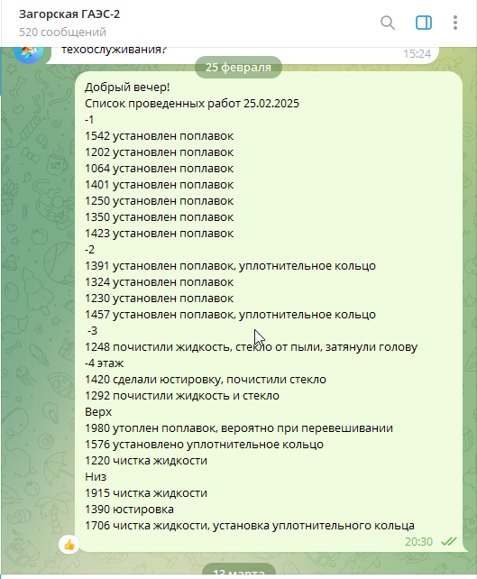

# Замена головы датчика

## Обычная замена головы

1. Карандаш в объекте → Гидронивелиры → Настройки датчиков → кнопка «Замена номера головы датчика»
2. Зайти в «Слои и датчики» → найти старый номер в каждом блоке питания → заменить на новый → сохранить
3. Зайти на удалённый ПК с этим датчиком
4. Остановить измерения → шестерёнка (настройки)
5. В левом окне найти старый номер → правая кнопка мыши → удалить
6. Написать новый номер → кнопка «Добавить»
7. Запустить измерения → дождаться ответа от нового датчика

Если есть задержка — сразу писать в общий чат, пока коллеги на объекте.

## Замена опорного датчика / добавление новых датчиков

Требуется при:
- Добавлении новых датчиков в контур
- Смене ролей: опорный и деформационный меняются местами
- Удалении неиспользуемых датчиков из системы

Порядок действий — через редактирование контура в настройках объекта.

После замены опорного датчика:
- Старые опорники удалить с карты (они перестают быть актуальными)
- Новые опорные датчики разместить на карте согласно плану

## Поплавки и колпачки

При замене поплавка на новый образец — отметить в таблице с поплавками и колпачками (SLA «Список проблемных датчиков»).

Также включить новые поплавки в Настройках датчиков.
