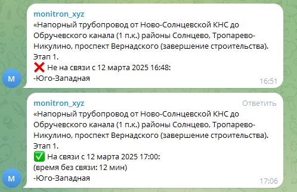

# Линия упала после замены датчика

## Что делать

!!! danger "Запрещается"
    Сразу делать вывод о программной проблеме.

Действия по порядку:

1. Вернуть старый датчик
2. Проверить работу линии
3. Проверить КЗ мультиметром
4. Проверить питание линии
5. Зафиксировать номер установленного датчика
6. Сделать фото коммутации
7. Результаты отправить в чат

## Что может быть причиной

- Неисправный датчик из партии (заводской брак, остаточное напряжение)
- Ослабшая изоляция, которая пробила при вибрации
- Короткое замыкание в самом датчике

Если датчик поставили, он поработал полтора часа и упал — это не значит, что была ошибка при монтаже. Датчик мог быть изначально неисправен.

## Передать снятый датчик

Снятый датчик передаётся в Монитрон с карточкой. Не оставлять лежать без истории — иначе он может попасть обратно в эксплуатацию.
